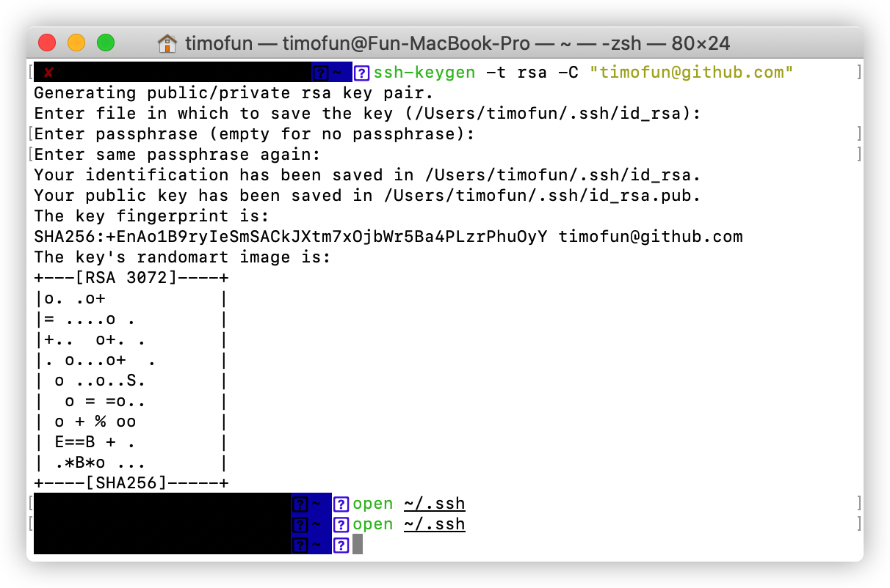

# Git 相关

## push报错
Permanently added 'github.com,13.229.188.59' (RSA) to the list of known hosts.
```sh
ssh-keygen -t rsa -C "xxx@xxx.com" // 重新生成rsa-key
```
  
打开 .ssh/id_rsa.pub. 复制ssh-key  
粘贴到github，个人setting -> SSH and GPG keys，添加个新的key

## vscode push失败
 

## GitHook 工具 —— husky 配置
husky 是一个 Git Hook 工具。本文主要实现提交前 eslint 校验和 commit 信息的规范校验。   
**1. 安装 husky，lint-staged，@commitlint/cli，@commitlint/config-conventional 依赖**   


*lint-staged: 用于实现每次提交只检查本次提交所修改的文件。
```sh
npm i -D husky lint-staged @commitlint/cli @commitlint/config-conventional
```
>注意：一定要使用 npm 安装 eslint 和 husky，因为在 windows 操作系统下, 用 yarn 安装依赖，不会触发 husky pre-commit 钩子命令。   


**2. 创建 .huskyrc**   
```
{
  "hooks": {
    "pre-commit": "lint-staged",
    "commit-msg": "commitlint -E HUSKY_GIT_PARAMS"
  }
}
```

**3. 创建 .lintstagedrc**   
```
{
  "src/**/*.js": "eslint"
}
```
设置 fix 可以自动修复错误：
```
{
   "src/**/*.js": ["eslint --fix", "git add"]
}
```
或者使用下面的配置，自动格式化代码（谨慎使用）：
```
{
   "src/**/*.js": ["prettier --write", "git add"]
}
```

**4. 创建 commitlint.config.js**   
```
module.exports = {
  extends: ['@commitlint/config-conventional'],
  rules: {
    'type-enum': [
        2,
        'always',
        [
            'feat', // 新功能（feature）
            'update', // 更新小逻辑
            'fix', // 修补bug
            'docs', // 文档（documentation）
            'style', // 格式（不影响代码运行的变动）
            'refactor', // 重构（即不是新增功能，也不是修改bug的代码变动）
            'perf', // 更改代码以提高性能
            'test', // 增加测试
            'build', // 构建过程或辅助工具的变动
            'ci', // 修改项目继续集成流程
            'chore', // 其他改动
            'revert' // 回滚
        ],
    ],
    'type-empty': [2, 'never'], // 提交不符合规范时,也可以提交,但是会有警告
    'subject-empty': [2, 'never'], // 提交不符合规范时,也可以提交,但是会有警告
    'subject-full-stop': [0, 'never'],
    'subject-case': [0, 'never'],
  }
}
```

## 同一台电脑同时使用gitHub和gitLab
一、进入ssh文件夹（cd ~/.ssh）
```sh
1.ssh-keygen -t rsa -C "xxx@xxx.com" // 重新生成rsa-key     
2.按回车，再按3次enter键，生成对应的gitlab密钥：id_rsa和id_rsa.pub   
3.将gitlab公钥即id_rsa.pub（~/.ssh）中的内容配置到公司的gitlab上   
4.ssh-keygen -t rsa -C "github邮箱地址" -f ~/.ssh/github_rsa   
5.将github公钥即github_rsa.pub中的内容配置到自己的github上  
```
二、进入密钥生成的位置（~/.ssh/），手动创建一个config文件（注意这个config文件要无后缀）。  
```sh
# 自己的github账号配置
Host github.com
    User git
    HostName github.com
    PreferredAuthentications publickey
    IdentityFile ~/.ssh/github_rsa

# 公司的gitlab账号配置(HostName为公司的gitlab地址)
Host gitlab.com
    User git
    HostName gitlab.xxx.com
    User git
    PreferredAuthentications publickey
    IdentityFile ~/.ssh/id_rsa 
```
字段配置简单说明：
```sh
Host
    Host可以看作是一个你要识别的模式，对识别的模式，配置对应的主机名和ssh文件
Port
    自定义的端口。默认为22，可不配置
User
    自定义的用户名，默认为git，可不配置
HostName
    真正连接的服务器地址
PreferredAuthentications
    指定优先使用哪种方式验证，支持密码和秘钥验证方式
IdentityFile
    指定本次连接使用的密钥文件
```
三、验证是否设置成功
```shell
# 测试github
ssh -T git@github.com

# 测试gitlab(@符后面的为公司gitlab地址)
ssh -T git@gitlab.xxx.com
```
四、git配置  
git系统级别对应的配置文件是git安装目录下的 /etc/gitconfig
```shell
用户级别配置

用户级别是配置公司gitlba账号还是自己github账号，可以自由选择。因为平常使用公司的代码频率较高，所以我选择将gitlab账号配置成用户级别。gitBath下执行如下命令：

git config --global user.name 'lfr' #公司账号名称
git config --global user.email 'lfr@company.com' #公司账号邮箱

仓库级别配置

local（仓库级别）配置成github的账号。选择一个文件夹作为github的本地仓库，在该文件夹里鼠标右键打开Git Bash Here，执行命令：git init

再执行命令：

git config --local user.name 'username' #github账号名称
git config --local user.email 'username@gmail.com' #github账号邮箱

之后自己的github的代码都应该在这个仓库下进行pull、push操作。
```
