# 资产管理流程

全套固定资产管理流程所需功能，均可从PC端“首页 → 快捷操作”中进入
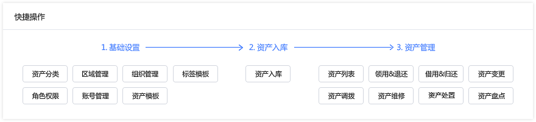

## 系统基础信息设置
精臣固定资产系统基础信息设置包括：角色权限设置、添加子账号、组织员工管理

### 1. 角色权限设置
入口：PC端左侧菜单 → 设置管理 → 角色权限设置  
系统给注册用户默认分配超级管理员角色；如需添加其他账号协助管理系统，需先为这些账号设置角色及功能权限
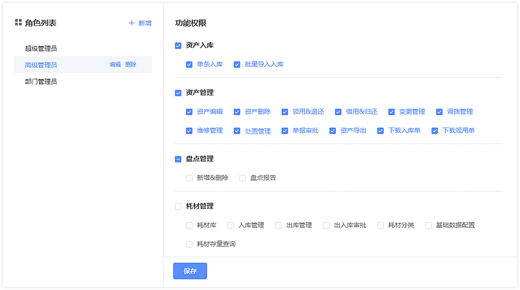

### 2. 添加子账号
入口：PC端左侧菜单 → 设置管理 → 账号管理  
当有多个管理员需使用系统时，可通过账号管理模块新建子账号，并给子账号分配角色及配置数据权限
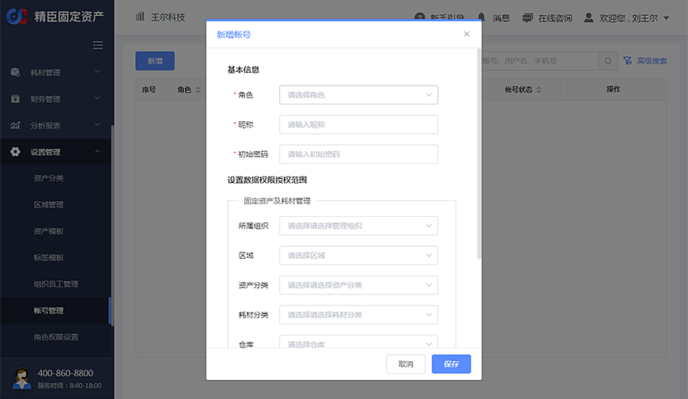  
 
### 3. 组织员工管理                      
入口：PC端左侧菜单 → 设置管理 → 组织员工管理  
用户可新建多个分公司及下级部门，并添加员工信息，员工信息支持批量导入
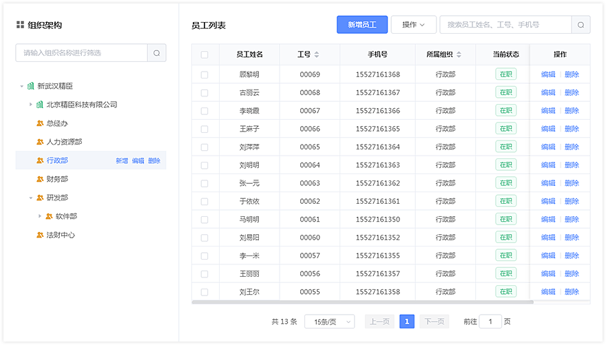  

## 资产管理基础信息设置
固定资产入库相关基础信息设置包括：资产分类设置、区域设置及标签模板设置

### 1. 资产分类
入口：PC端左侧菜单 → 设置管理 → 资产分类  
支持用户配置多层级的资产分类，资产管理更加便捷
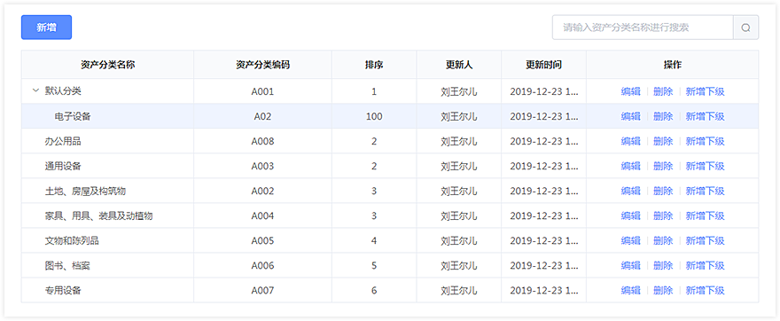  

### 2. 区域管理
入口：PC端左侧菜单 → 设置管理 → 区域管理  
支持用户配置资产分布区域，便于按区域管理资产                 
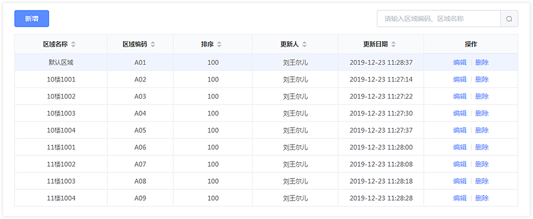  

### 3. 标签模板
 入口：PC端左侧菜单 → 设置管理 → 标签模板  
选择资产标签模板便于后期的打印，系统支持自定义标签模板（不可变更或删除）                                    
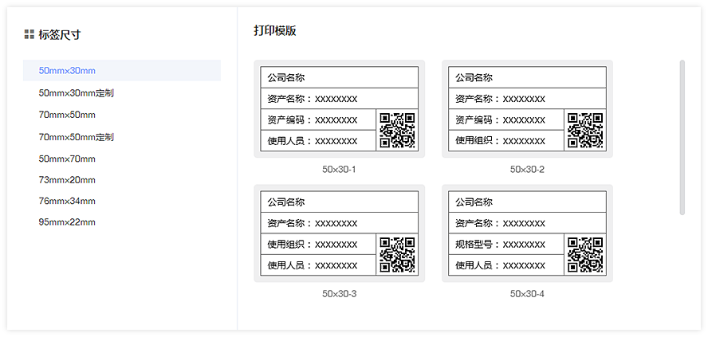

## 资产入库及标签打印

### 1. 资产入库
入口：PC端左侧菜单 → 资产入库  
系统支持单条录入资产，也可通过下载模板批量导入资产；批量导入功能提供任务列表查看导入进度                     
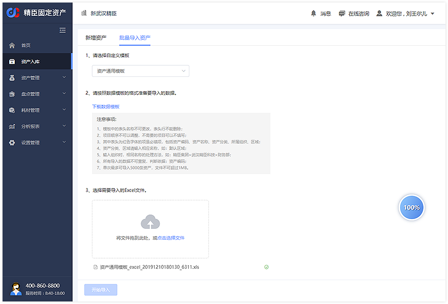  

### 2. 打印资产标签
入口：PC端左侧菜单 → 资产管理 → 资产列表  
在PC端，可以筛选资产信息，选择需要打印的资产标签；PC端需通过USB数据线连接指定型号的打印机，首次打印需下载安装打印驱动
   
打印驱动下载地址：
<a href="/handbook/B50-PrnInst-3.0.2019.516.exe" download="B50-PrnInst-3.0.2019.516.exe">精臣B50系列驱动&打印服务</a>
<!-- [精臣B50系列驱动&打印服务](http://www.jc-ai.com/about2/show.php?id=23)   -->
 
移动端可通过蓝牙连接指定型号的打印机（仅支持精臣B50系列）直接打印标签
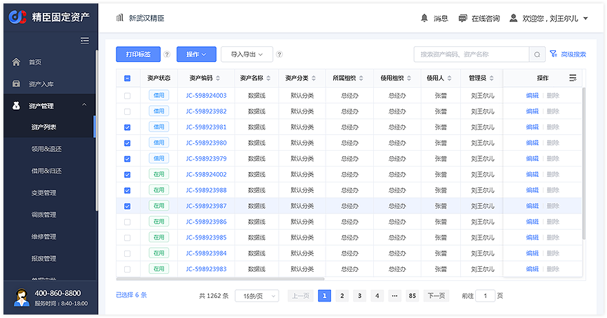  

## 资产管理
系统资产管理菜单下有各项资产管理操作入口，支持资产领用退还、借用归还、变更调拨及处置等操作；用户也可在资产列
表中对资产进行各项快捷操作
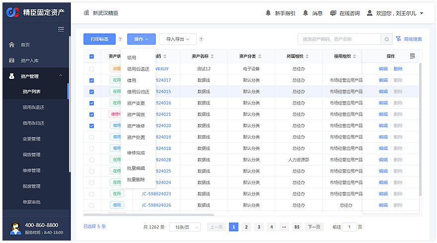  
各项资产管理操作应用场景如下：  
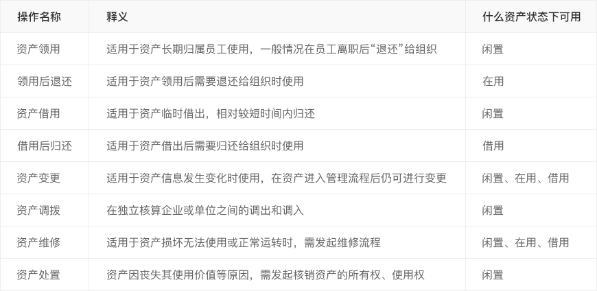  

## 盘点管理
支持按条件搜索资产创建盘点单，可选择员工参与盘点并上报名下资产（需开通微信员工端），支持盘点单审核及完成后损益处理操作  
同时针对0资产的新用户，系统可创建初始化清查盘点单（需开通微信员工端），让全体员工参与清查公司资产，详细操作说明如下：  

[精臣固定资产盘点操作说明](/pc/inventory.html)  

## 数据报表

### 1. 首页资产统计概况
展现当前用户资产总体概况，提供多维度资产情况统计
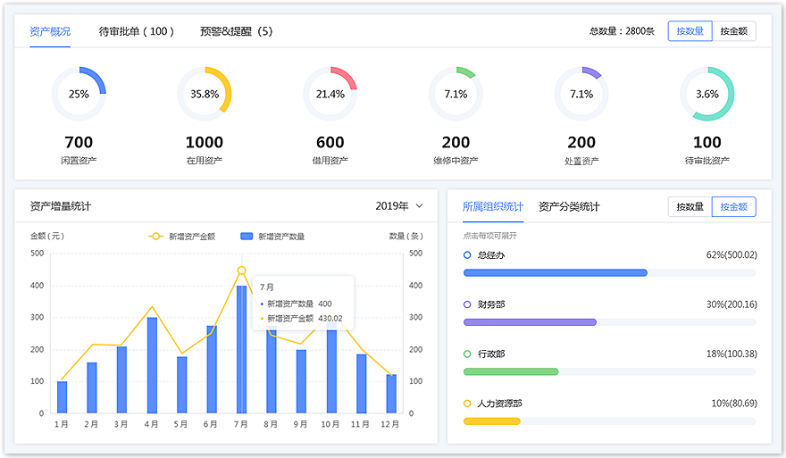 

### 2. 资产履历
可以查看资产全生命周期历史处理记录
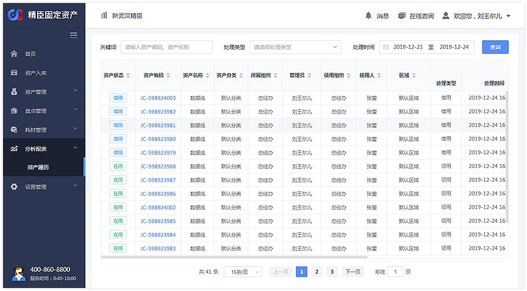      

### 3. 资产分类统计报表
按资产分类汇总展现企业资产总量及总金额，支持按所属公司及部门筛选，可配置展现各状态资产数量及金额指标   
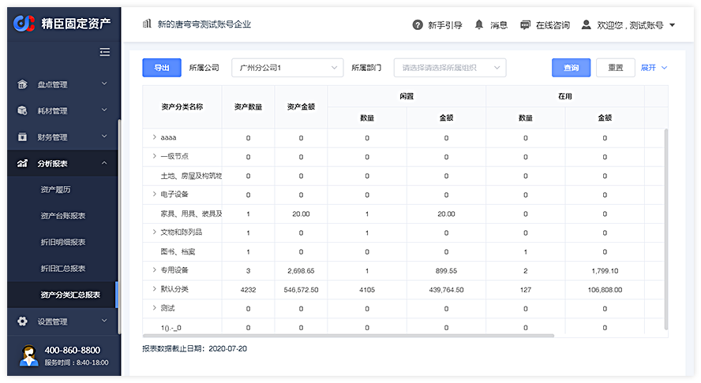                           
                            
                            
                                                   
