# 耗材管理流程

耗材管理模块（需开通）提供耗材信息维护、耗材出入库及审批功能，并可查看耗材存量信息；耗材管理流程所需功能，
均可在PC端【耗材管理】菜单下操作

## 系统基础信息设置
使用耗材管理功能，首先需要配置子管理员账号、录入组织员工信息；  
相应操作说明，详见[资产管理流程 → 系统基础信息设置](/pc/guide.html#系统基础信息设置)

## 耗材管理基础信息设置
耗材管理相关基础信息设置包括：耗材分类、仓库、品牌及供应商设置

### 1. 耗材分类
入口：PC端左侧菜单 → 耗材管理 → 耗材分类  
支持用户配置多层级的耗材分类，耗材管理更加便捷
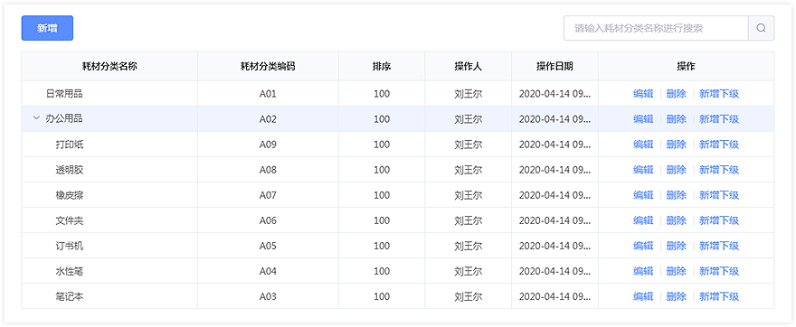

### 2. 仓库设置
入口：PC端左侧菜单 → 耗材管理 → 基础数据配置  
支持用户配置耗材存储的仓库，便于按仓库管理耗材
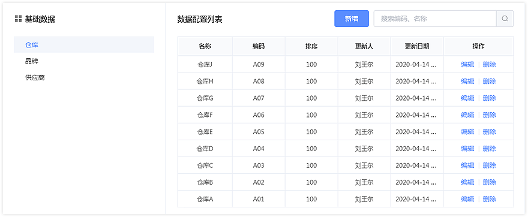

### 3. 品牌设置
入口：PC端左侧菜单 → 耗材管理 → 基础数据配置  
支持用户提前录入耗材品牌，方便快速新建耗材档案
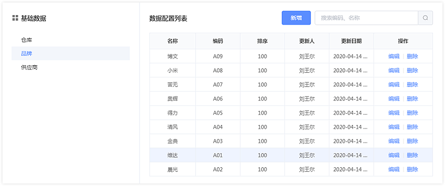

### 4. 供应商设置
入口：PC端左侧菜单 → 耗材管理 → 基础数据配置  
支持用户提前录入供应商，方便快速入库耗材
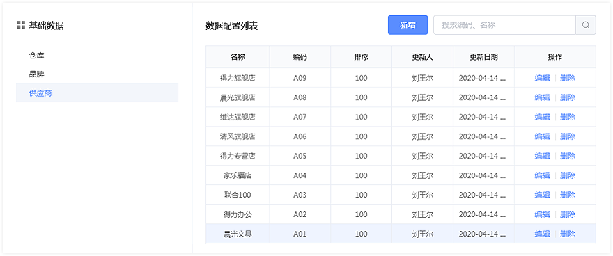

## 新建耗材档案及标签打印

### 1. 新建耗材档案

入口1：PC端左侧菜单 → 耗材管理 → 耗材库  
系统支持创建单个耗材档案，也可通过下载模板批量导入耗材档案；批量导入功能提供任务列表查看导入进度       
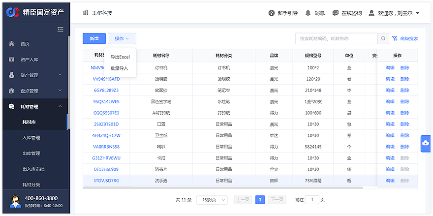
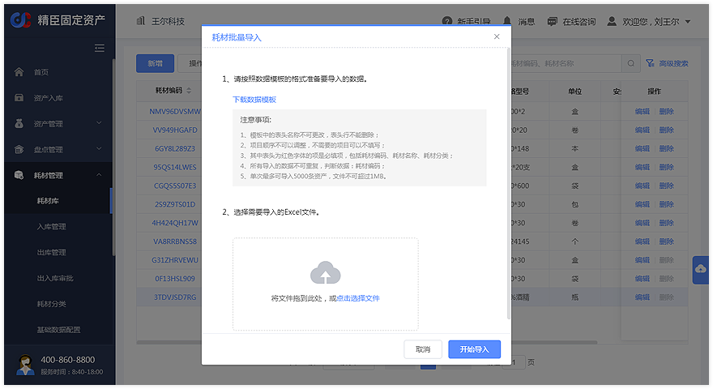

入口2：APP端耗材管理页签 → 新增耗材   
在新增耗材页面，用户可先扫码耗材条形码，系统将自动填写主要属性信息；用户在系统填写内容基础上调整并上传图片，保存完成耗材新增     
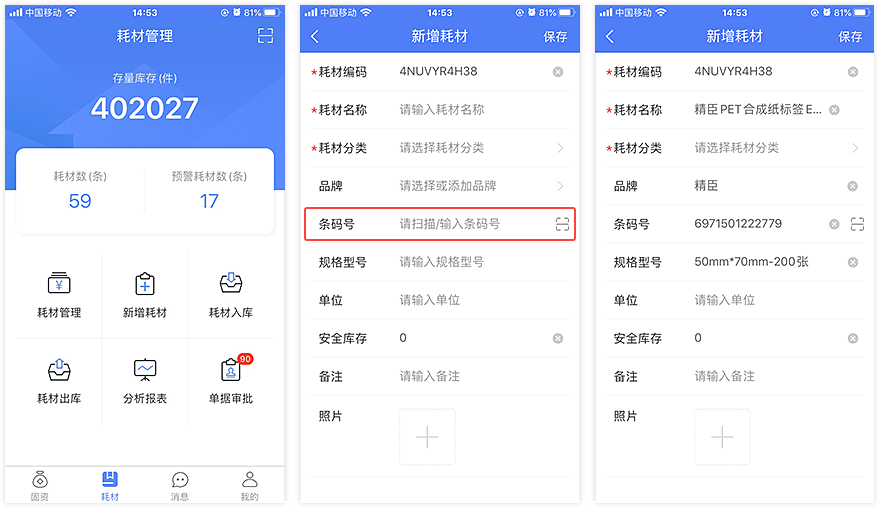

### 2. 打印耗材标签

入口：APP端耗材管理页签 → 耗材管理  
在APP端，可以筛选耗材信息，选择需要打印的耗材标签尺寸及二维码内容；APP端可通过蓝牙连接指定型号的打印机（仅支持精臣B50系列）直接打印标签                 
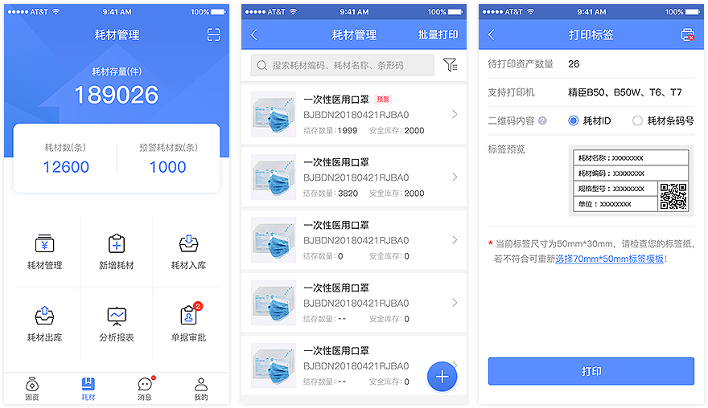

## 耗材入库
系统支持指定存储仓库，批量入库耗材，也可在APP端【耗材入库】，扫码添加耗材入库  
入口1：PC端左侧菜单 → 耗材管理 → 入库管理  
点击【新增】打开新增入库窗口；填写入库信息后，添加耗材并输入入库数量及金额，点击【确认入库】即可
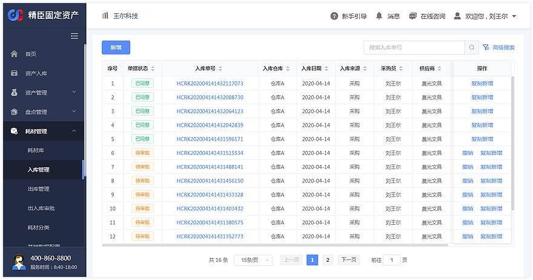
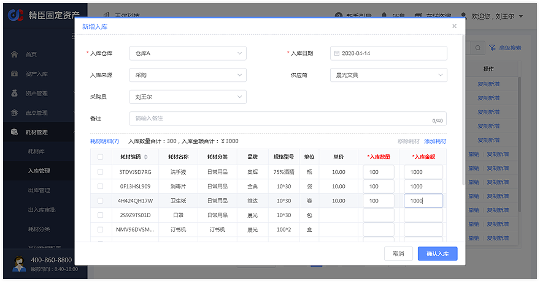

入口2：APP端耗材管理页签 → 耗材入库  
点击【耗材入库】图标进入耗材入库列表页；点击【新建入库】/【扫码入库】添加耗材后进入耗材入库申请页，填写入库信息后，输入入库数量及金额，点击【保存】即可
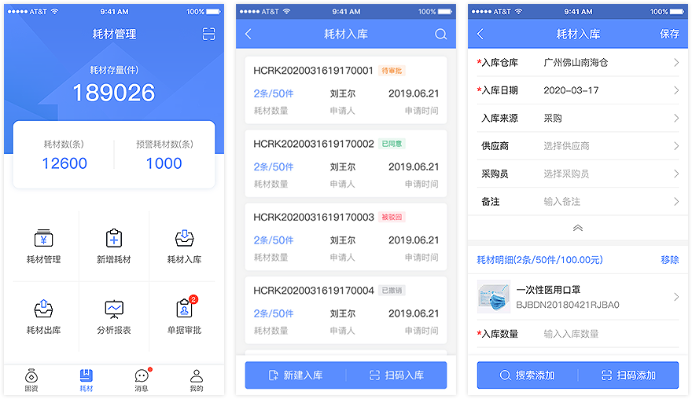

## 耗材出库
系统支持指定出库仓库，批量出库耗材，也可在APP端【耗材出库】，扫码添加耗材出库  
入口1：PC端左侧菜单 → 耗材管理 → 出库管理  
点击【新增】打开新增出库窗口；选择出库仓库，填写出库信息后，添加耗材并输入出库数量，点击【确认出库】即可               
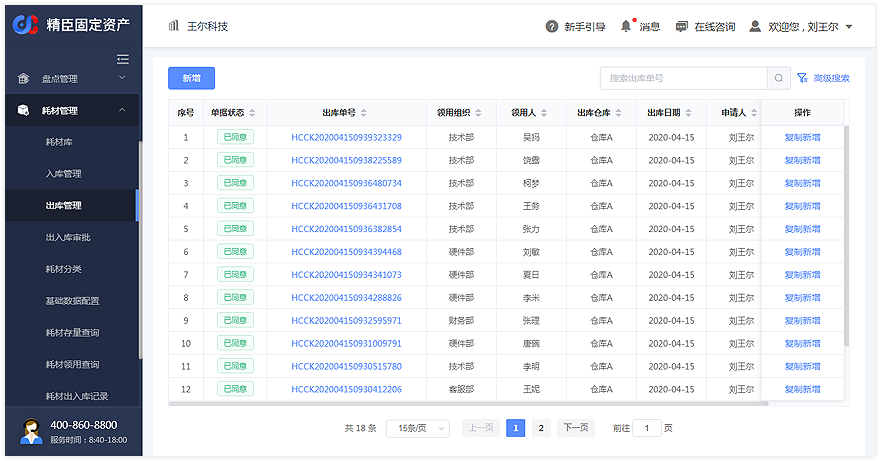
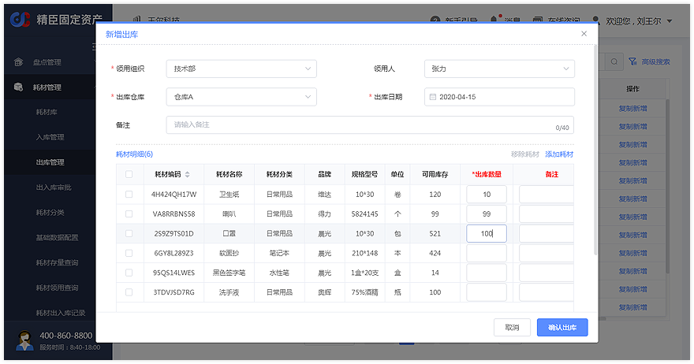

入口2：APP端耗材管理页签 → 耗材出库  
点击【耗材出库】图标进入耗材出库列表页；点击【新建出库】/【扫码出库】添加耗材后进入耗材出库申请页，选择出库仓库，填写出库信息后，输入出库数量，点击【保存】即可
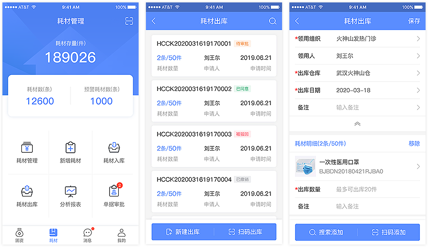

## 耗材数据查询
系统在PC端提供耗材存量查询、领用明细查询、出入库记录查询功能；同时在APP端提供了库存概况月报和领用统计月报  
入口1：PC端左侧菜单 → 耗材管理

### 1. 耗材存量查询 

默认展现全部仓库的耗材存量，可按仓库、耗材分类、预警状态筛选，也可通过搜索耗材名称、编码查询指定耗材存量；点击单个耗材【结存数量】可查看各仓库的耗材存量情况
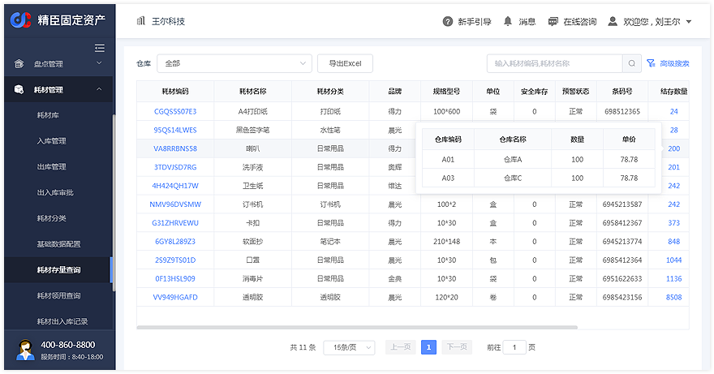

### 2. 耗材领用查询

默认展现所有出库耗材的领用情况，可按领用组织、领用人、仓库等搜索条件查询耗材领用情况
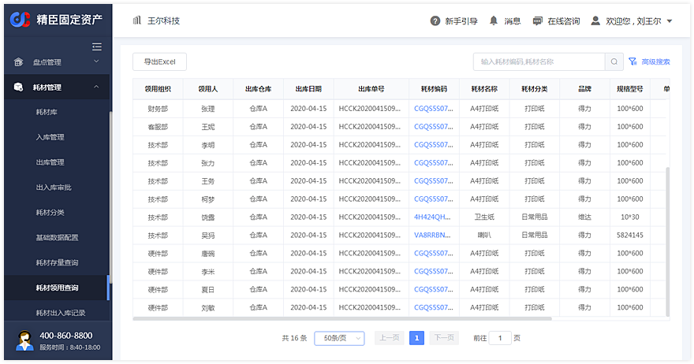

### 3. 耗材出入库查询

默认展现耗材入库记录，切换【出库记录】页签可查看耗材出库记录；可按仓库、耗材分类等搜索条件查询出入库记录
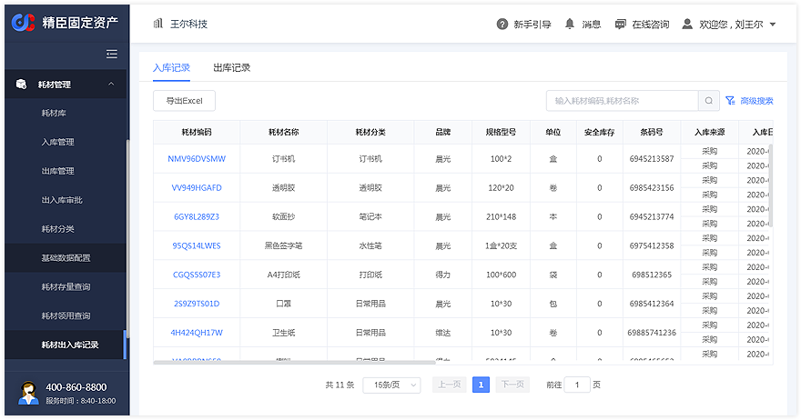

入口2：APP端耗材管理页签 → 分析报表
### 库存概况月报&领用统计月报

默认展现库存概况月报，切换【领用统计】页签可查看领用统计月报  
库存概况月报默认按一级耗材分类展现月库存数据，支持按仓库筛选，可下钻查看下级耗材分类库存数据  
领用统计月报默认按一级组织展现月领用数据，支持按仓库、耗材分类筛选，可下钻查看下级组织领用数据
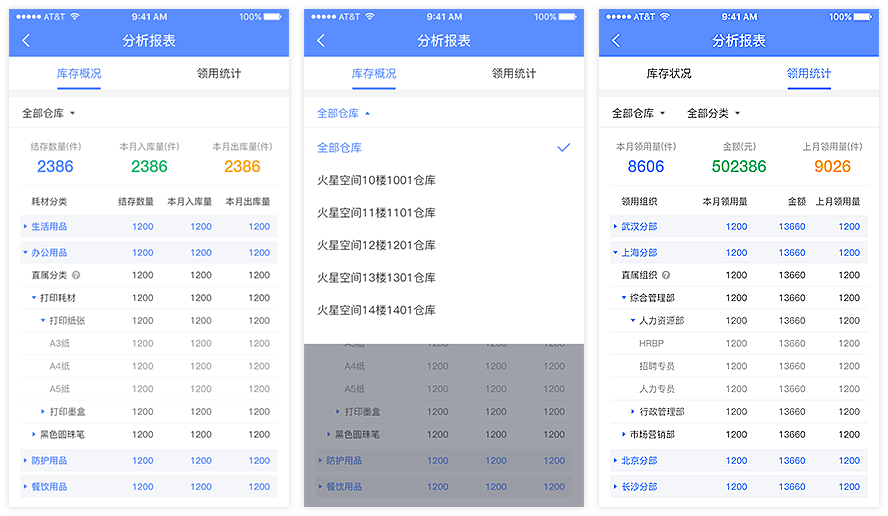
                              

                            
                            
