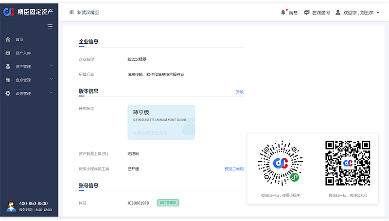
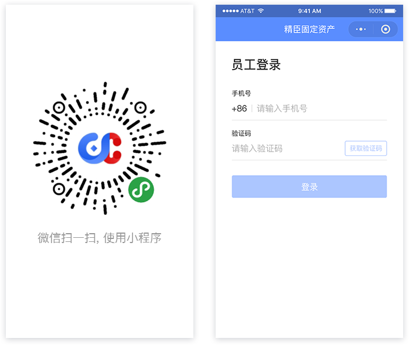
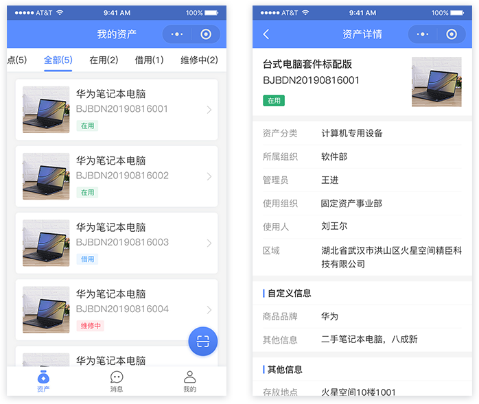
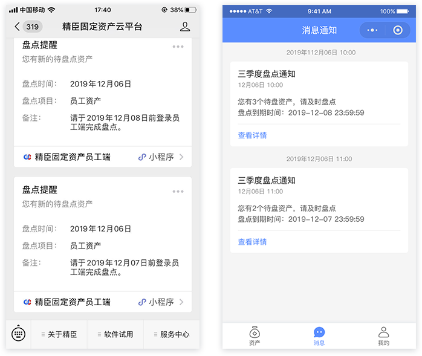
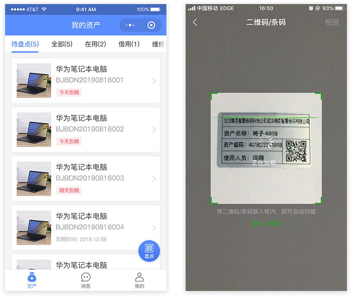
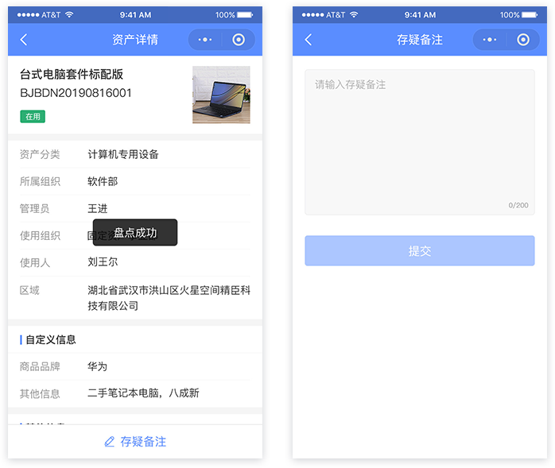
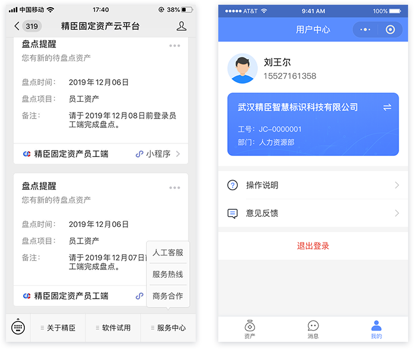
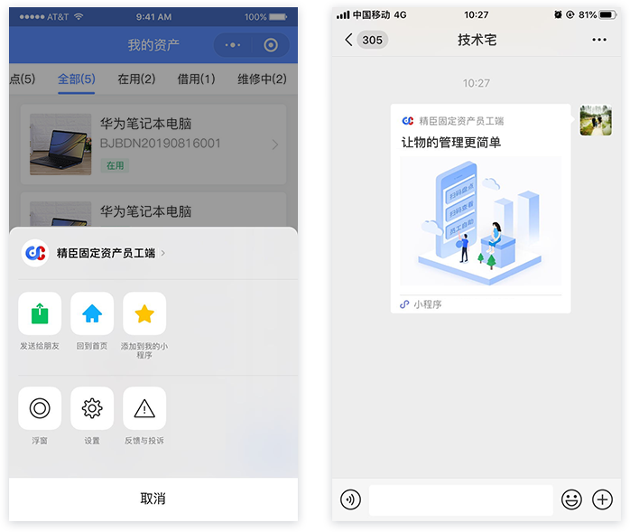
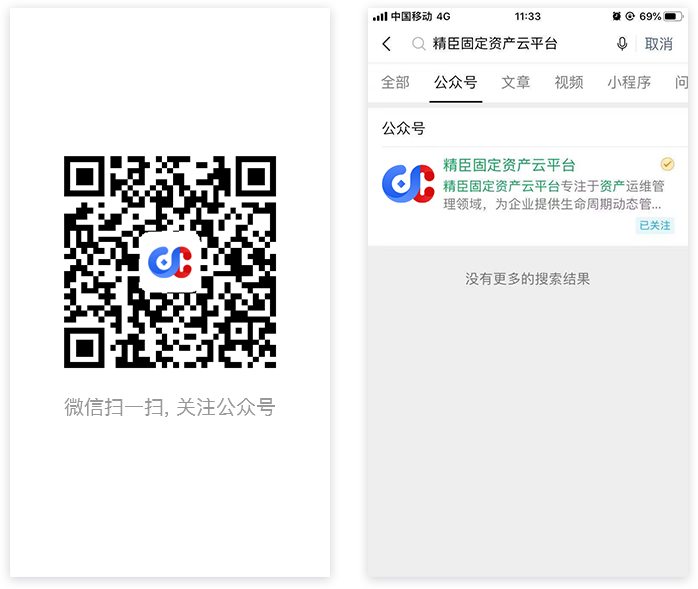

<h1 style="textAlign: center">精臣固定资产员工端操作说明</h1>

### 概述
通过精臣固定资产员工端，用户可以查看自己名下的固定资产，以及自助扫码盘点；“企业版”及“尊享版”用户可在精臣固定资产平台PC端【用户中心】版本信息中查看微信员工端开通状态，并扫码二维码下载小程序及关注公众号。

### 登录
扫描下方二维码或微信搜索小程序“精臣固定资产员工端”，获取员工端小程序。初次使用员工端，需要输入手机号及验证码登录。  

### 我的资产
首页【我的资产】界面显示当前员工名下所有资产，点击每个资产卡片， 可查看资产详情；或点击界面右下角【扫码】按钮，扫描资产标签二维码查看。

### 自助盘点
用户可以通过员工端参与公司资产盘点，负责盘点自己名下的资产。从公众号【盘点提醒】消息或员工端【消息】模块，可点击进入【待盘点】资产列表，在员工端【我的资产】界面也会直接展现。

点击【待盘点】界面右下角的【盘点】按钮，进入扫码界面，扫描待盘资产标签二维码，进入资产详情页，完成该资产盘点。

如对所盘资产存在疑问，可在扫码后资产详情页，点击【存疑备注】按钮，填写备注信息。

### 意见反馈
在使用中如有疑问或优化建议，可点击微信公众号底部【服务中心-人工客服】菜单进行反馈；也可从员工端底部【我的】页签进入用户中心，点击【意见反馈】模块进行反馈。

### 分享小程序
在【我的资产】界面，点击右上角【···】菜单，点击【发送给朋友】，可将小程序分享给其他用户。

### 添加到我的小程序
在【我的资产】页面，点击右上角【···】菜单，点击【添加到我的小程序】，可将员工端添加到我的小程序列表，方便用户快捷使用。  

### 关注公众号
扫描下方二维码或搜索公众号“精臣固定资产云平台”，关注精臣固定资产公众号，可在公众号中及时查看小程序待办消息。

