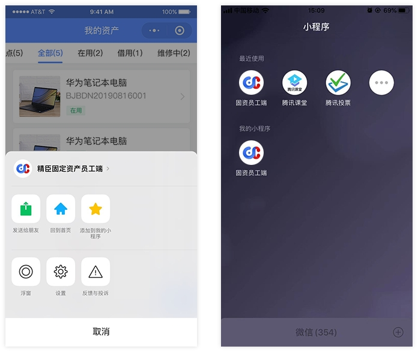

<h1 style="textAlign: center">精臣固定资产员工端操作说明</h1>

### 概述
通过精臣固定资产员工端，用户可以查看自己名下的固定资产，以及自助扫码盘点；“企业版”及“尊享版”用户可在精臣固定资产平台PC端【用户中心】版本信息中查看微信员工端开通状态，并扫码二维码下载小程序及关注公众号。

### 登录
扫描下方二维码或微信搜索小程序“精臣固定资产员工端”，获取员工端小程序。初次使用员工端，需要输入手机号及验证码登录。  

### 我的资产
登录后，默认展现【我的资产】页面，用户也可通过点击底部选项卡【资产】菜单进入  
【我的资产】页面显示当前用户名下的所有资产，通过点击每个资产卡片，可以查看资产详情；或者通过页面右下角【扫码】
功能，扫描资产标签二维码查看目标资产详情

### 资产借用
入口：审批 → 资产自助 → 借用  
在审批界面点击资产自助模块下的【借用】按钮，进入资产借用单申请页  
首先需选择【资产所在区域】，再扫码或搜索添加所选区域下需借用的资产；下方资产列表可以单资产左滑移除，或全部清空

信息填完后，点击【提交】按钮提交资产借用申请；已提交的单据，可在【审批-待审批】列表中查看

### 资产领用  
入口：审批 → 资产自助 → 领用  
在审批界面点击资产自助模块下的【领用】按钮，进入资产领用申请页  
首先需选择【资产所在区域】，再扫码或搜索添加所选区域下需领用的资产；下方资产列表可以单资产左滑移除，或全部清空  

信息填完后，点击【提交】按钮提交资产领用申请；已提交的单据，可在【审批-待审批】列表中查看  

### 资产归还
入口：审批 → 资产自助 → 归还  
在审批界面点击资产自助模块下的【归还】按钮，进入资产归还申请页  

可通过扫描或搜索添加自己名下需归还的资产；信息填完后，点击【提交】按钮提交资产归还申请；已提交的单据，可在【审  
批-待审批】列表中查看  

### 资产退还
入口：审批 → 资产自助 → 退还  
在审批界面点击资产自助模块下的【退还】按钮，进入资产退还单申请页  

可通过扫描或搜索添加自己名下需退还的资产；信息填完后，点击【提交】按钮提交资产退还申请；已提交的单据，可在【审  
批-待审批】列表中查看  

### 资产报修
入口：审批 → 资产自助 → 报修  
在审批界面点击资产自助模块下的【报修】按钮，进入资产报修申请页  

可通过扫描或搜索添加自己名下需报修的资产；信息填完后，点击【提交】按钮提交资产报修申请；已提交的单据，可在【审批-待审批】列表中查看   
  

### 耗材领用
入口：审批 → 耗材自助 → 领用  
在审批界面点击耗材自助模块下的【领用】按钮，进入耗材领用单申请页  
首先需选择“领用仓库”，再通过扫码或搜索添加需领用的耗材，填写各种耗材需领用的数量；下方耗材列表支持单耗材左滑  
移除，或全部清空操作  
点击【提交】按钮提交耗材领用申请，可在待审批列表查看申请详情  

### 自助盘点
入口：资产 → 待盘点  
用户可以通过员工端参与公司固定资产盘点，负责盘点自己名下的资产；从公众号【盘点提醒】消息或员工端【消息】模块，  
可以进入【待盘点】资产列表页，在员工端【我的资产】页面也会直接展现

点击【待盘点】界面右下角的【盘点】按钮，进入扫码界面，扫描待盘资产标签二维码，进入资产详情页，完成该资产盘点

如对所盘资产存在疑问，可在扫码后资产详情页，点击【存疑备注】按钮，填写备注信息

### 上报资产
入口：资产 → 上报  
员工参与公司资产盘点时，若发现不在自己名下但实际在用的资产，可在【我的资产-上报】界面中上报；点击【上报】按  
钮，进入资产上报界面，填写资产详细信息，并上传资产照片，点击【保存】即上报成功   

新增上报的资产，在盘点任务完成前，可编辑或删除   

### 意见反馈
在使用中如有疑问或优化建议，可点击微信公众号底部【服务中心-人工客服】菜单进行反馈；也可从员工端底部【我的】页签进入用户中心，点击【意见反馈】模块进行反馈。

### 分享小程序
在【我的资产】界面，点击右上角【···】菜单，点击【发送给朋友】，可将小程序分享给其他用户。

### 添加到我的小程序
在【我的资产】页面，点击右上角【···】菜单，点击【添加到我的小程序】，可将员工端添加到我的小程序列表，方便用户快捷使用。  

### 关注公众号
扫描下方二维码或搜索公众号“精臣固定资产云平台”，关注精臣固定资产公众号，可在公众号中及时查看小程序待办消息。

