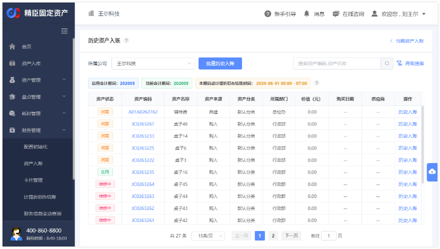

# 财务管理流程
  
财务管理模块（需开通），提供固定资产的财务方面管理，包括财务模块启用、资产入账、卡片管理、计提折旧并结账、财
务报表查询功能，均可在PC端“财务管理”菜单下操作

## 开启财务模块
入口：PC端左侧菜单 → 财务管理 → 配置初始化  
在配置初始化页面，选择需开启财务模块的公司，下方默认展现财务模块启用须知，告知开启财务模块后各项管理规则，请
仔细阅读

点击【启用】按钮，目标公司财务数据进入启用会计期间，默认为当前月份；在入账资产前，可先按资产分类设置【预计使  
用期间数】和【残值率】项默认值，用于自动计算资产折旧金额

公司财务模块开启后，在配置初始化页面，将展现当前公司的财务期间信息和相关说明   

### 按资产分类设置折旧要素
入口：PC端左侧菜单 → 设置管理 → 资产分类   
用户可在新增或编辑资产分类时，直接设置【预计使用期间数】和【残值率】，系统提供默认值分别为36个月及5.00%   
提供【将默认值应用到下级分类】勾选项，勾选后保存，将当前窗口内这两项的值同步更新到当前分类下所有下级分类   

## 入账固定资产
资产入账功能提供用户入账符合条件的固定资产，创建资产卡片   
系统支持单条入账资产，也可通过下载待入账资产数据模板，批量导入入账；批量导入功能提供任务列表查看导入进度   
对于处于启用会计期间（开启财务模块首月）的公司，可选择入账历史资产（当期开始计提折旧）；所有开启了财务模块的   
公司，可以入账当期新增资产（入账下期开始计提折旧）   
所有入账资产将按【动态平均年限法】计算每期折旧金额                    

注：【所属部门】为空的资产，因无法指定折旧分摊部门，将无法入账，需将资产调拨到具体部门下，才能进行入账操作

### 1. 入账当期资产
入口：PC端左侧菜单 → 财务管理 → 资产入账   
在资产入账页面，选择需入账资产的公司，下方默认展现可入账的资产  

点击目标资产后的【当期入账】按钮，按规则填写相关信息，保存生成资产卡片，可在卡片管理菜单下查询   

### 2. 批量入账当前资产
用户可通过搜索条件，筛选需入账的资产   
点击【批量入账】按钮，下载包含查询结果所有资产的入账配置信息，查询结果多于5000条，将默认下载前5000条资产信息

下载的模板中，系统会根据资产信息及财务属性默认值填充，用户按需调整后上传导入即可   

### 3. 入账历史资产
入口：PC端左侧菜单 → 财务管理 → 资产入账 → 历史资产入账

点击资产入账页面的【历史资产入账】按钮，进入历史资产入账页面   
在历史资产入账页面，可单条或批量入账历史资产，操作同当期资产入账   
仅启用会计期间内可入账历史资产，当前期间结账后，将无法再入账历史资产  

### 4. 历史资产入账初始化数据查看
所有历史资产入账的初始化数据，可在【初始化信息查询】菜单查看  
查询入口：PC端左侧菜单 → 财务管理 → 初始化信息查询

## 计提折旧&结账
对于已开启了财务模块的公司，系统将从启用会计期间次月初开始，按月自动计提公司内资产折旧金额，并在计提完成后自动结账  
系统将在每月1日自动计提折旧并结账上个会计期间资产，结账后进入新会计期间；用户可在系统自动处理前手动处理   
入口：PC端左侧菜单 → 财务管理 → 计提折旧&结账   

每月16号开始，计提折旧&结账页面将展现当前期间手动结账按钮，状态为「未计提」的公司，可先预览当期计提明细     

确认无误后，可选择点击【计提折旧并结账】按钮，核对公司财务综合信息，手动计提折旧并结账     

注：在系统执行计提折旧和结账期间，将无法对当前公司资产进行所有财务相关操作，
包括但不限于：资产入账、财务信息变动、资产调拨及其审批、资产处置及其审批、编辑资产供应商等

## 查看报表数据
结账完成后，可在分析报表下查看目标公司已结账期间的台账（资产台账报表）和折旧数据（折旧明细报表、资产汇总报表）    

## 财务信息变动
对于已入账资产，原则上不建议修改资产卡片信息，但系统仍提供了资产卡片信息修改及删除功能，相关操作记录可在【财  
务信息变动查询】菜单查看   

入口：PC端左侧菜单 → 财务管理 → 卡片管理   

### 财务信息编辑
在当期资产入账后至本期结账前，可对财务信息进行编辑  
在卡片管理页面，点击目标资产【编辑】按钮，可按规则修改财务信息  
财务信息修改后立即生效；按更新后数据计算的月折旧额，将在下个期间生效  

### 财务信息变更
所有历史入账资产（包括启用会计期间入账的历史资产），均可对财务信息进行变更  
在卡片管理页面，点击目标资产【变更】按钮，可按规则修改财务信息，操作同财务信息编辑  

### 资产卡片删除  
所有资产入账期间结账前（包括启用会计期间入账的历史资产），均可删除资产卡片，对应资产变为【未入账】状态，可以再次入账

