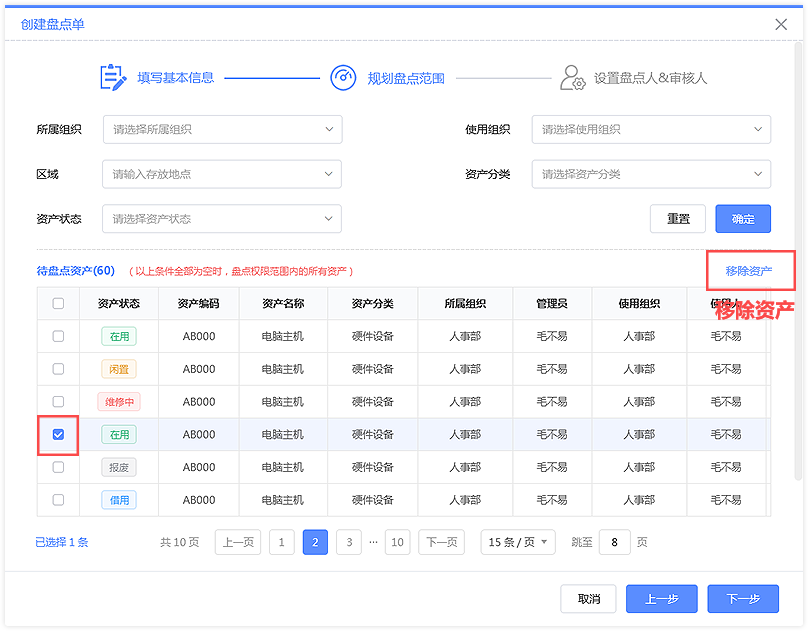

<h1 style="textAlign: center">精臣固定资产盘点操作说明</h1>

## 常规盘点流程
对有存量资产的企业用户，平台提供常规盘点流程，帮助用户清查企业内资产
  

## 1. 创建盘点单
入口：PC端  →  盘点管理  →  盘点单管理  
在盘点单管理页面，点击【创建盘点单】按钮，创建盘点单
  
注：盘点单创建人账号角色需有盘点管理【新增&删除】权限
  
1）填写盘点单名称（必填）及备注信息（选填），点击【下一步】，筛选资产范围  
  
如果盘点范围没有设置，默认盘点数据权限范围内全部资产，否则系统根据设置的盘点范围创建盘点单；查询结果  
支持按单资产移除  
  
2）点击【下一步】，可按“所属组织”或“区域”分配盘点人；选择审核人，点击【完成】按钮，新盘点单创建
完成
  
## 2. 下载盘点任务
入口：APP端  →  首页  →  盘点管理  
安装并打开精臣固定资产APP，登录盘点人账号，点击首页【盘点管理】菜单，进入盘点管理页面，展现分配给当  
前盘点人的所有盘点任务  
  
### 移动端支持离线盘点操作
1）点击目标盘点任务，进入盘点任务详情页，APP将自动下载当前盘点任务  
2）在盘点任务详情页，盘点人可查看未盘、已盘及新增资产列表；详情页下方操作区提供【盘点】、【同步数据】  
  及【提交审核】功能  
3）IOS及Android手机APP端支持相机扫码盘点，指定型号的PDA支持红外或RFID盘点  
  
## 3.  任务盘点及结果上传
### 3.1  资产盘点
在盘点任务详情页，盘点人点击【盘点】按钮（或PDA红外物理键），开始扫码盘点  
如果扫描到任务内一个资产标签，则盘点界面上展现的未盘-1，已盘+1，该资产进入已盘列表  
  
### 3.2  已盘资产存疑备注
盘点过程中如发现资产实际信息与系统中不同，可在已盘资产列表中找到目标资产，点击进入资产详情页，点击  
【存疑备注】，记录资产问题
  
数据同步（或提交审核）后，已盘资产的存疑备注信息会展现在PC端盘点单资产详情页中，也可批量导出查看  
  
### 3.3  同步数据上传
盘点完成后，在APP端盘点任务详情页，点击【同步数据】，APP会把本地已盘资产及存疑备注信息同步至PC端  
  
在PC端盘点单详情页，盘点单审核人可整单或按任务查看资产盘点情况  
  
### 3.4  新增资产
盘点过程中，如发现无法辨别或无标签的资产，可在相机扫码盘点或红外盘点页面，点击【新增资产】，记录该资  
产的信息，支持添加照片    
  
保存的新增资产记录在盘点任务详情页“新增资产”页签展现，可进行编辑或删除  
  
提交审核后，新增资产信息同步至PC端，盘点单完成后作为盘盈记录，支持盘盈新增入库操作，集体操作详见：  
“5. 损益处理”    
  
### 3.5  提交审核
盘点完成后，在APP端盘点任务详情页，点击【提交审核】，APP会把本地盘点信息同步至PC端，包括已盘资产、
存疑备注、新增资产等   
  
在PC端盘点单详情页，该盘点任务状态变为“待审核”，盘点单审核人可审核任务盘点情况（审核人无法修改，  
如需调整可驳回给盘点人处理）    
  

## 4. 审核通过
审核人可在PC端盘点单详情页审核盘点人提交的任务信息，如所有任务都已提交，审核人可点击【同意】按钮，  
整单审核通过  
  
审核通过的盘点单状态变为“已完成”，未盘资产出现在“盘亏”列表，新增资产出现在“盘盈”列表；盘盈、盘  
亏列表中的资产可在“损益处理”模块进行处理   
  

## 5. 损益处理
入口1：PC端左侧导航 → 盘点管理 → 盘点单管理 → 损益处理  
进入“已完成”状态盘点单详情页，点击【损益处理】按钮，进入盘点单损益处理详情页   
  
入口2：APP端  →  固资  →  盘点管理  →  损益处理  
点击固资页签下的【盘点管理】进入盘点管理页，点击【损益处理】切换至损益处理盘点单列表页，点击目标盘点  
单进入盘点单损益处理详情页     
  

### 5.1 盘盈资产处理
#### PC端盘盈资产处理如下：  
在“盘盈”资产列表，点击目标资产【新增入库】按钮，展现单资产入库窗口  
  
补全资产相关信息，点击【保存】按钮，完成资产入库，该盘盈资产记录变为“已处理”状态  
  
#### APP端盘盈资产处理如下：
在“盘盈”资产列表，点击目标未处理的资产进入该资产详情页，点击【资产入库】按钮进入资产入库界面，补全  
资产相关信息，点击【保存】按钮，完成资产入库  
  
完成的资产入库后，该盘盈资产记录变为“已处理”状态，点击该资产可进入资产详情页查看处置结果  
  
### 5.2 盘亏资产处理
#### PC端盘亏资产处理如下：
在“盘亏”资产列表，可勾选【只呈现可处置资产】选项，筛选当前能做盘亏处理的闲置资产   
点击目标资产【盘亏处置】按钮，若资产实际为“闲置”状态，则可在窗口中填写报废信息，提交报废单申请   
  
提交成功后，该盘亏资产记录变为“已处理”状态   
  
盘亏列表也支持选择多个资产，进行批量盘亏处置   
  
#### APP端盘亏资产处理如下：
在“盘亏”资产列表，可【点击筛选可处置资产】按钮，筛选当前能做资产处理的闲置资产   
点击目标未处理的资产进入该资产详情页，点击【资产处置】按钮进入资产处置界面，补全处置相关信息，点击   
【保存】按钮，完成资产处置  
  
完成的资产处置后，该盘亏资产记录变为“已处理”状态，点击该资产可进入资产详情页查看处理结果   
  

## 初始化盘点清查
对0资产的企业用户，平台提供初始化清查盘点流程（需开通微信员工端），引导企业内员工参与资产清查上报工  
作，协助企业清查企业内资产  
  
### 1. 创建清查盘点单
入口：PC端  →  盘点管理  →  盘点单管理  
用户在创建清查盘点单前，需先在系统中录入资产分类、组织员工、区域信息，并确保系统内无存量资产  
  
在盘点单管理页面，点击【创建盘点单】按钮，创建初始化清查盘点单  
注：盘点单创建人需同时具备全量资产相关数据权限  
  
### 2. 盘点员上报资产
入口：APP端 → 盘点管理 → 盘点单详情页 → 扫码盘点 → 新增资产   
盘点员可在盘点单详情页，点击【盘点】按钮进入相机扫码盘点或红外盘点页面，点击【新增资产】进入新增资产   
界面，填写资产详细信息，并上传资产照片，点击【保存】即新增成功  
  
### 3. 员工上报资产
入口：微信小程序员工端  →  资产  →  上报   
员工可在【我的资产 - 上报】界面中上报名下在用的资产；点击【上报】按钮，进入资产上报界面，填写资产详细   
信息，并上传资产照片，点击【保存】即上报成功  
  
### 4. 提交盘点结果
入口：APP端  →  固资  →  盘点管理  →  目标盘点单   
盘点员上报完成后，在APP端盘点任务详情页，点击【提交审核】，APP会把管理员上报资产信息同步至PC端  
  
### 5. 入库盘盈资产
入口1：PC端左侧菜单  →  盘点管理  →  盘点单管理  →  损益处理   
盘点单状态为“已完成”盘点单可进行损益处理；选择目标盘点单，点击操作栏的【损益处理】按钮进入该盘点单   
的盘盈资产列表  
  
选择目标未处理的资产，点击操作栏的【新增入库】按钮入库盘盈资产
  
入口2：APP端  →  固资  →  盘点管理  →  损益处理  
在APP端【盘点管理 - 损益处理】列表页，点击目标盘点单，进入该盘点单的盘盈资产列表页；点击未处理的资产  
进入该资产详情页，点击【资产入库】按钮入库盘盈资产  
  
