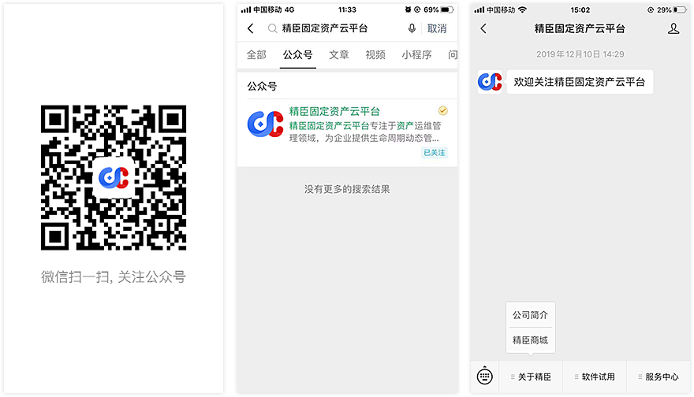

# 系统其它功能

## 微信员工端
微信小程序员工端（需开通），支持员工通过手机号（需在组织员工管理模块配置）登录员工端，扫码查看名下资产，并参
与公司盘点任务，详细操作说明如下：

[精臣固定资产员工端操作说明](/pc/emp_manage.html)  

## 打印机及耗材
系统支持的打印机机型号包括：精臣B50/B50W/T6/T7、博思得G2000e/L200e/C168、佐藤CL4NX标签打印机，其中
精臣B50系列（精臣B50/B50W/T6/T7）同时支持PC端、移动端及PDA三端连接，打印固定资产标签

购买入口：扫描下方二维码或微信搜索“精臣固定资产云平台”，关注精臣固定资产公众号，点击“关于精臣 → 精臣商城”
 
                            
