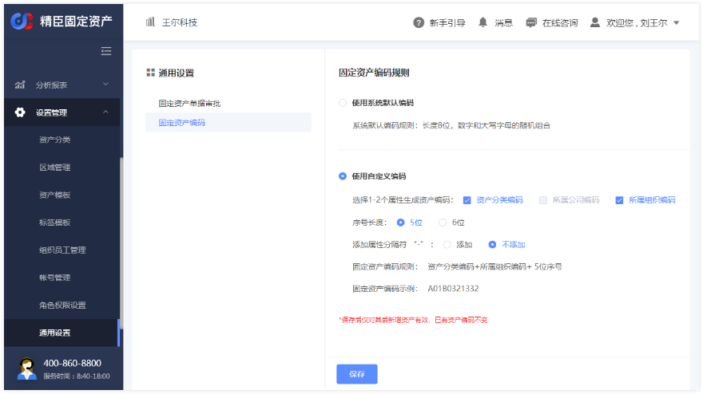
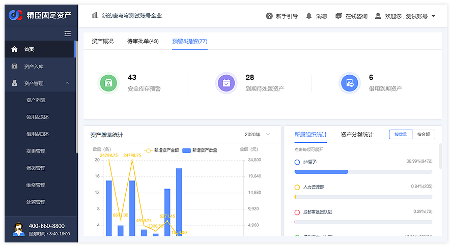
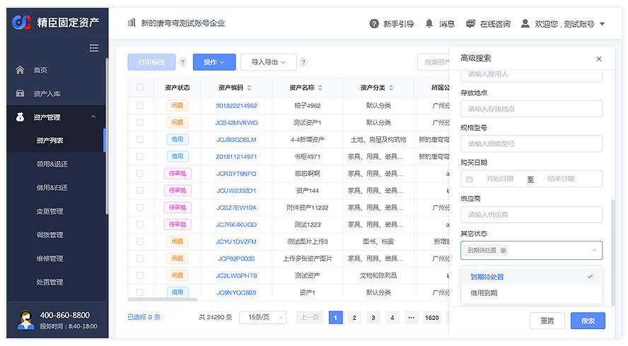
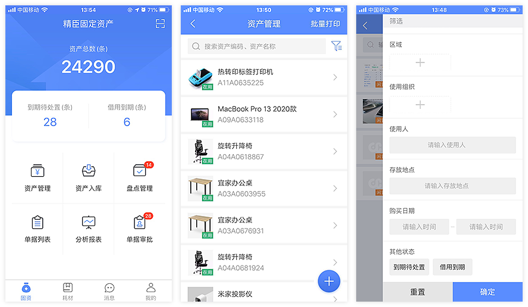
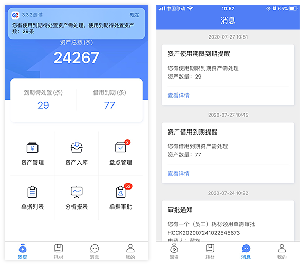
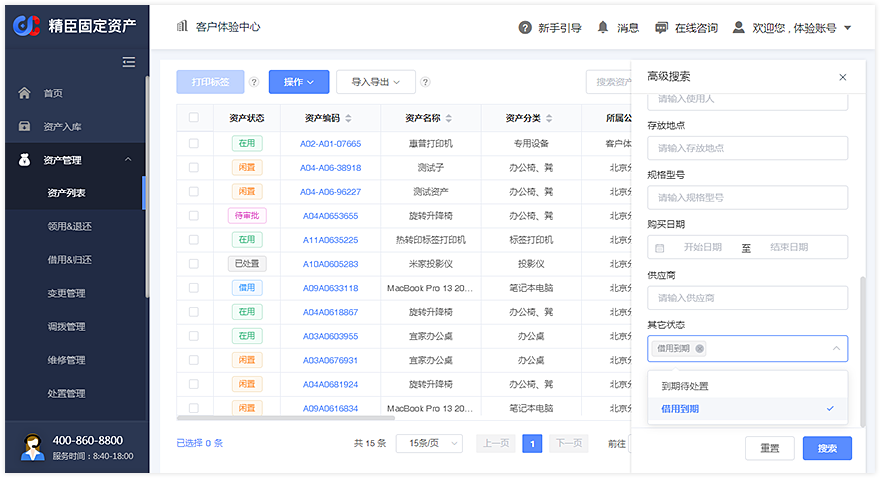
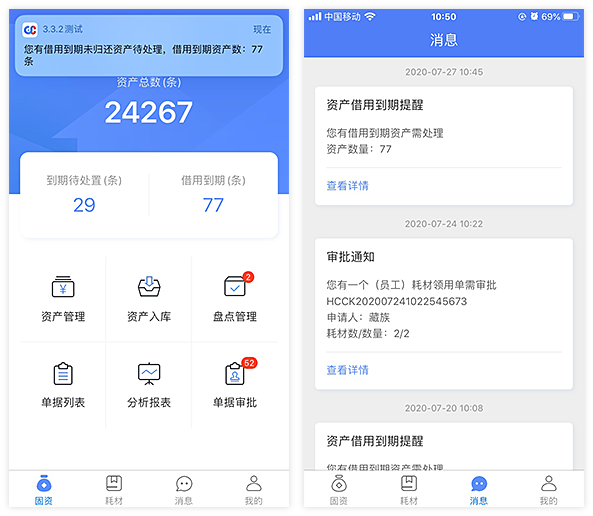
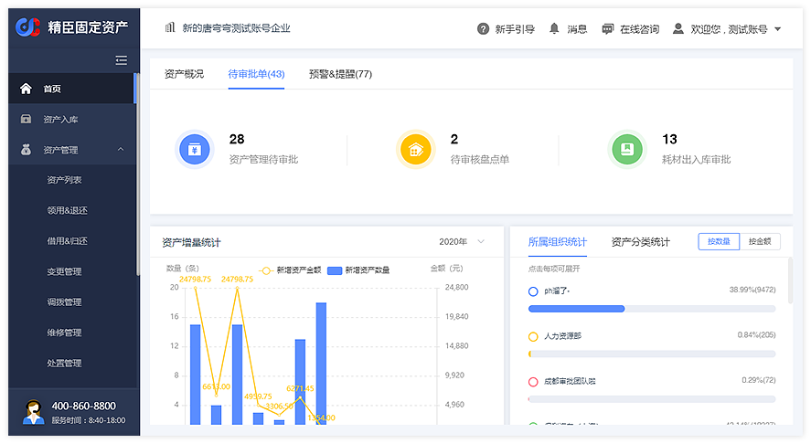
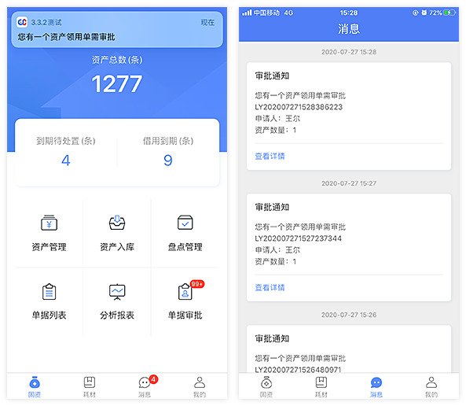

# 系统其它功能

## 微信员工端
微信小程序员工端（需开通），支持员工通过手机号（需在组织员工管理模块配置）登录员工端，扫码查看名下资产，
自助申请资产领用、借用、退还、归还、报修，及领用耗材，并参与公司资产清查和盘点任务，详细操作说明如下：

[精臣固定资产员工端操作说明](/pc/emp_manage.html)  

## 资产编码自定义
资产编码自定义功能（需开通），允许用户自定义固定资产编码生成规则，需由超级管理员在PC端“通用设置”菜单下操作   
入口：PC端左侧菜单 → 设置管理 → 通用设置 → 固定资产编码

 
用户需先选择【使用自定义编码】，按需配置编码规则，点击保存后立即生效  
新编码规则生效后，其后入库的资产都会按新编码规则自动生成资产编码  

注：因不同编码规则下，批量入库规则及模板有所不同；在修改编码规则后，需按对应入库模板进行资产入库

## 关键消息提醒
### 1. 资产使用期限到期待处置提醒
根据资产购买时间（或入库时间）及使用期限信息，系统会在资产使用期限到期的当月，及时提醒用户对到期资产进行处置  
   
入口1：PC端首页 → 预警&提醒 → 到期待处置资产  
在【预警&提醒】页签中，用户可看到截止本月所有使用期限到期需处置的资产数量，点击【到期待处置资产】，系统将打  
开资产管理下的资产列表页面，并展现所有符合条件的资产  
   
用户也可直接在资产列表页面，通过高级搜索中【其它状态-到期待处置】，筛选到期资产  
   
入口2：APP端 → 固资  → 到期待处置资产  
在资产管理首页上方展现【到期待处置】指标，点击该指标进入资产列表，查看所有到期待处置资产  
用户也可直接在资产列表中通过【其他状态】条件，筛选到期待处置资产  
  
入口3：APP端推送消息及消息列表  
如存在到期待处置资产，系统会根据资产信息中【管理员】属性，在到期当月1日推送消息提醒给该资产的管理员，点击消息  
进入资产列表，查看所有到期待处置资产  
同时，系统会自动发送到期待处置资产消息给有权限的管理员，管理员可到消息列表中查看  
  

### 2. 资产借用到期未归还提醒
对于借用状态的资产，系统会在预计归还时间到期时，及时提醒用户借用到期资产进行归还   
  
入口1：PC端首页 → 预警&提醒 → 借用到期资产  
在【预警&提醒】页签中，用户可看到截止前一天借用到期需归还的资产数量，点击【借用到期资产】，系统将打开资产管  
理下的资产列表页面，并展现所有符合条件的资产  
  
用户也可直接在资产列表页面，通过高级搜索中【其它状态-借用到期】，筛选借用到期资产  
 
入口2：APP端 → 固资 → 借用到期资产  
在资产管理首页上方展现【借用到期】指标，点击该指标进入资产列表，查看所有借用到期资产  
用户也可直接在资产列表中通过【其他状态】条件，筛选借用到期资产  
   
入口3：APP端推送消息及消息列表  
如存在借用到期资产，系统会根据资产信息中【管理员】属性，在到期次日推送消息提醒给该资产的管理员，点击消息进入资产列表，查看所有借用到期资产  
同时，系统会自动发送借用到期资产消息给有权限的管理员，管理员可到消息列表中查看  
   

### 3．单据待审批消息提醒  
入口1：PC端首页 → 待审批单  
在【待审批单】页签中，用户可看到需审批的资产管理单据及耗材出入库单据数量，
点击单据数量，系统将打开对应单据列表页面，用户选择单据进行审批  
  
入口2：APP端推送消息及消息列表  
如存在指定审批人的待审批单据，系统会在单据提交成功时，推送消息提醒给该单据的指定审批人，
点击消息进入单据列表，用户选择单据进行审批；同时，管理员可到消息列表中查看待审批单据提醒   
  

## 打印机及耗材
系统支持的打印机机型号包括：精臣B50/B50W/T6/T7、博思得G2000e/L200e/C168、佐藤CL4NX标签打印机，
其中精臣B50系列（精臣B50/B50W/T6/T7）同时支持PC端、移动端及PDA三端连接，打印固定资产标签  
购买入口：扫描下方二维码或微信搜索“精臣固定资产云平台”，关注精臣固定资产公众号，点击“关于精臣 → 精臣商城”
 
                            
