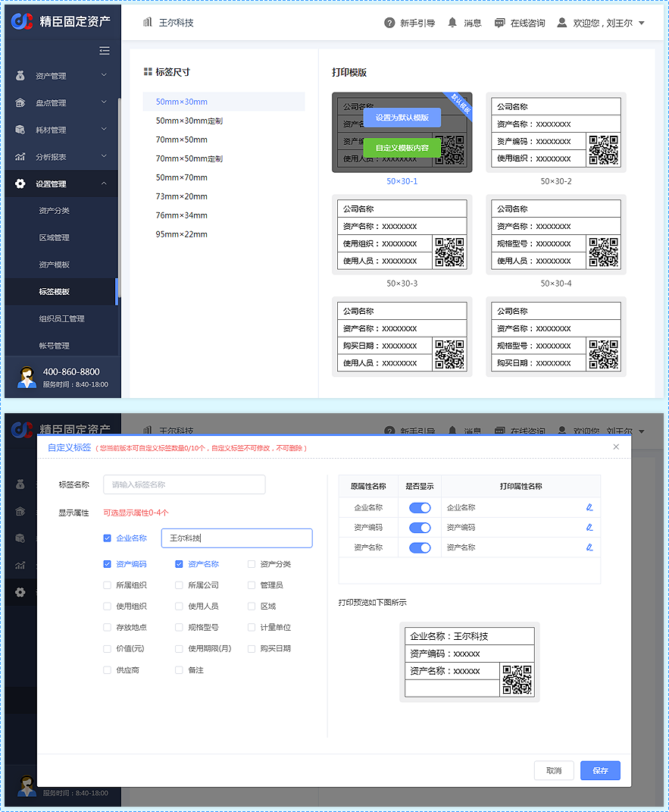
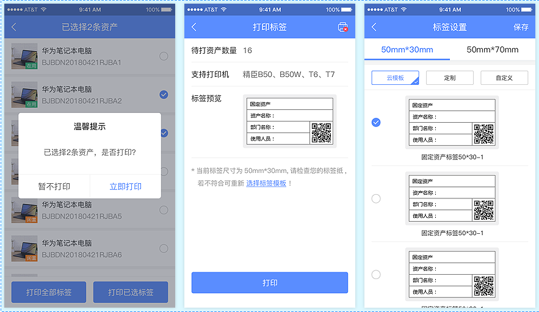
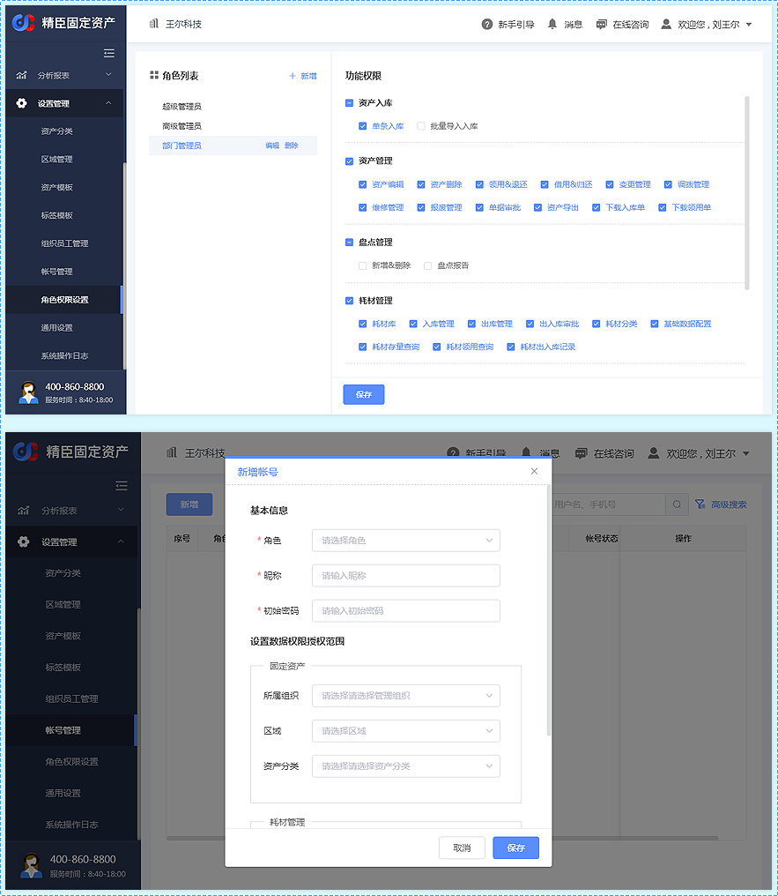
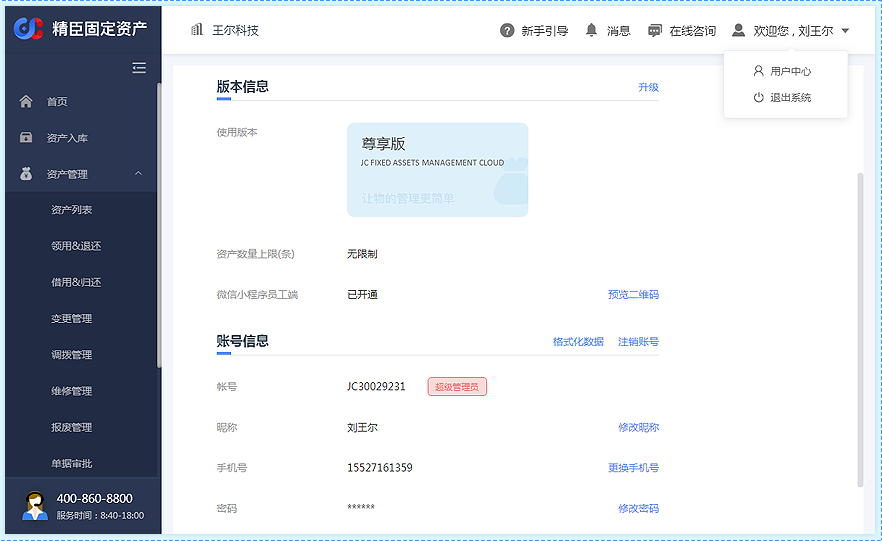
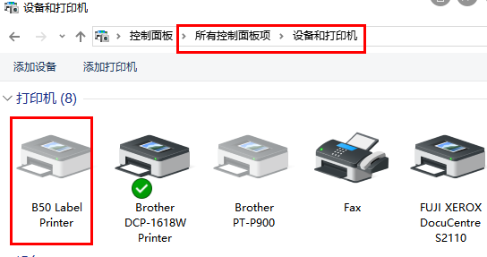
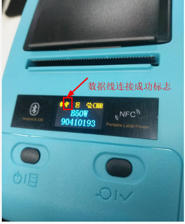
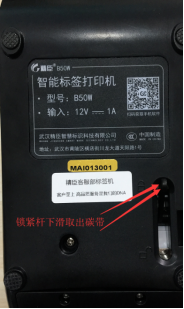

# 常见问题

## 组织设置
**Q：可以在一个账号里面，设置两个并列的总公司吗？**  
A：暂不支持设置并列的总公司，可以在其下面设置并列的子公司

## 标签模版
**Q：怎么打印出其他公司名字，怎么自定义标签模板？**  
A：1. 点击【设置管理 → 标签模板】进入标签模板界面，鼠标滑到目标打印模板上，点击【自定义模板内容】  
&nbsp;&nbsp;&nbsp;&nbsp;&nbsp;&nbsp;2. 在打开的自定义标签弹窗中勾选并输入企业名称，按照需求设置标签模板，保存后不可更改删除
 
                            
**Q：手机上可以选择打印模板吗，在哪里选择？**  
A：可以，具体操作如下：   
&nbsp;&nbsp;&nbsp;&nbsp;&nbsp;&nbsp;1. 点击资产管理界面的【批量打印】按钮进入批量打印资产选择界面   
&nbsp;&nbsp;&nbsp;&nbsp;&nbsp;&nbsp;2. 勾选需要打印的资产后，点击【打印已选标签】，在弹出的提示框里点击【立即打印】   
&nbsp;&nbsp;&nbsp;&nbsp;&nbsp;&nbsp;3. 点击【选择标签模板】进入标签选择界面，选择所需的模板，点击【保存】即可                            
 

## 角色权限设置  
**Q：如何新增管理员？**  
A：1. 点击【设置管理 → 角色权限设置】进入角色权限设置界面，点击【新增 → 保存】，“功能权限"中勾选需要的权限   
&nbsp;&nbsp;&nbsp;&nbsp;&nbsp;&nbsp;2. 点击【设置管理 → 账号管理】进入账号管理界面，点击【新增帐号】，在打开的新增账号弹窗中填写账号信息     
&nbsp;&nbsp;&nbsp;&nbsp;&nbsp;&nbsp;注：新增账号中的数据权限若不勾选，默认可以管理所有资产和耗材，勾选后只能管理选中条件资产和耗材   
&nbsp;&nbsp;&nbsp;&nbsp;&nbsp;&nbsp;3.设置后，管理员用系统生成的账号和初始密码在电脑端登录，登录后可以绑定手机号                            
 

**Q：一个企业可以有几个超级管理员？超级管理员能更换使用人吗？**  
A：一个企业用户只能拥有一个超级管理员账户   
&nbsp;&nbsp;&nbsp;&nbsp;&nbsp;&nbsp;企业用户注册的第一个账户默认为“超级管理员”，可以通过“更换手机号”来更换使用人     
&nbsp;&nbsp;&nbsp;&nbsp;&nbsp;&nbsp;在PC端头部导航右侧点击【用户名 → 用户中心】进入用户中心界面，在账号信息模块点击【更换手机号】更换使用人                             
   

## 资产入库 
**Q：资产编码可以手动输入吗？**  
A：单条录入时是随机自动生成的，也可以手动更改，批量导入时需要在表格中手动填写                       
&nbsp;&nbsp;&nbsp;&nbsp;&nbsp;&nbsp;资产编码可以输入2-30位，可包含字母、数字、符号“-” 

**Q：照片能导入多少张？**  
A：一条资产只能上传一张照片，不能批量导入，需要逐条添加                         
&nbsp;&nbsp;&nbsp;&nbsp;&nbsp;&nbsp;（若多条资产添加同一张照片，可在资产管理中，勾选要添加同样照片的资产，点击【操作 → 批量编辑】，上传照片，    
&nbsp;&nbsp;&nbsp;&nbsp;&nbsp;&nbsp;即可批量添加）

**Q：资产是公用的没有明确的使用人或多个使用人，怎么填写使用人？**  
A：可以不填写使用人，放在使用组织下，默认为该组织下“在用”的资产                       

**Q：批量导入主要事项**  
A：1. “资产分类”、“资产名称”、“资产编码”、“所属组织”和“区域”为必填属性，其他可以为空。                       
&nbsp;&nbsp;&nbsp;&nbsp;&nbsp;&nbsp;资产编码可以输入2-30位，可包含字母、数字、符号“-” 
&nbsp;&nbsp;&nbsp;&nbsp;&nbsp;&nbsp;但建议您填写，为后期对资产更全面的统计分析做准备。  
&nbsp;&nbsp;&nbsp;&nbsp;&nbsp;&nbsp;2. 模板中第一行表头的名称不能更改、不能删除，表格中只能有一个工作表，单元格里不能设置公式  
&nbsp;&nbsp;&nbsp;&nbsp;&nbsp;&nbsp;3. 资产编码只能输入2—30位，只可包含字母、数字、符号“-”  
&nbsp;&nbsp;&nbsp;&nbsp;&nbsp;&nbsp;4. 资产名称只能输入2-20位  
&nbsp;&nbsp;&nbsp;&nbsp;&nbsp;&nbsp;5. 表格里的资产分类、组织、管理员、使用人、区域必须是之前已经录入到系统里了的  
&nbsp;&nbsp;&nbsp;&nbsp;&nbsp;&nbsp;6. 目前支持的购买日期格式是：2019/4/18  [年—月—日 时:分:秒、  年/月/日 时:分:秒、  年\月\日 时:分:秒]。时分秒  
&nbsp;&nbsp;&nbsp;&nbsp;&nbsp;&nbsp;可以不填写，导入后默认是0  
&nbsp;&nbsp;&nbsp;&nbsp;&nbsp;&nbsp;7. 使用组织需要和使用人匹配，例如您使用人填写的是行政部的员工，使用组织就只能填写行政部的    
&nbsp;&nbsp;&nbsp;&nbsp;&nbsp;&nbsp;8. 若不填写使用组织，则资产是闲置状态，如果填写使用人，需要先填写使用组织才能显示出来  

**Q：数据导入的时候没有数量吗 / 支持批量录入吗？比如桌子购置100个，能一次输入吗，然后会自动生成编码？**  
A：固定资产管理原则是一物一码，建议同类多个资产进行分开录入，用不同的编码，批量录入则需手动录入资产编码                         

**Q：导入提示错误“导入的数据列数和匹配模板不一致”**  
A：下载系统中的数据模板表格，在表格中填写资产信息，表格的表头名称不可有更改和删除  

## 资产管理 

**Q：为什么有些资产删除不了？**  
A：有过资产的日常处理，包括变更、领用、借用、归还、调拨、维修、报废任意一种操作后就不可直接删除操作了                       
&nbsp;&nbsp;&nbsp;&nbsp;&nbsp;&nbsp;若资产是在用状态，点击【资产列表 → 操作 → 领用后退还 → 资产报废 → 报废审批 → 批量删除】  
&nbsp;&nbsp;&nbsp;&nbsp;&nbsp;&nbsp;若资产是借出状态，点击【资产列表 → 操作 → 借用后归还 → 资产报废 → 报废审批 → 批量删除】   
&nbsp;&nbsp;&nbsp;&nbsp;&nbsp;&nbsp;若资产是闲置状态，点击【资产列表 → 操作 → 资产报废 → 报废审批 → 批量删除】  
&nbsp;&nbsp;&nbsp;&nbsp;&nbsp;&nbsp;资产删除后，之前打印的标签二维码是失效的，系统中的操作记录是不能删除的   

**Q：为什么资产录入后全都显示闲置？**  
A：新增资产后，若使用组织属性为空，则资产的状态为【闲置】，否则为【在用】

**Q：导入进去之后数据编码是错乱的，在哪里调整顺序？**  
A：点击资产编码旁的三角符号进行调整

**Q：资产处理记录在哪里查看？**  
A：查看单条资产处理记录，点击该条资产的资产编码即可查看，或者在资产履历界面查看  
&nbsp;&nbsp;&nbsp;&nbsp;&nbsp;&nbsp;按处理类型查看处理记录点击【资产管理 → 选择您需要查看的处理类型 → 查看】

## 耗材管理 
**Q：耗材如何分类？**  
A：您可以根据您公司具体情况设置耗材分类的呢，一般可以分为以下类别的呢：文具事务用品、办公耗材、日杂百货、办公
&nbsp;&nbsp;&nbsp;&nbsp;&nbsp;&nbsp;设备、办公家具、财务用品等（仅供参考）

## 标签打印

**Q：怎么打印标签？**  
A：PC端打印：                      
&nbsp;&nbsp;&nbsp;&nbsp;&nbsp;&nbsp;1.安装打印机驱动（可在电脑控制面板-设备与打印机中查看是否有B50）
&nbsp;&nbsp;&nbsp;&nbsp;&nbsp;&nbsp;   
&nbsp;&nbsp;&nbsp;&nbsp;&nbsp;&nbsp;2.用数据线将打印机连接到电脑上(连接正常打印机上会有一个数据线的图标)  
&nbsp;&nbsp;&nbsp;&nbsp;&nbsp;&nbsp;    
&nbsp;&nbsp;&nbsp;&nbsp;&nbsp;&nbsp;3.精臣系列打印机点击【资产管理 → 勾选需要打印的资产 → 打印标签】；兄弟P900W、爱普生LW1000打印机点击  
&nbsp;&nbsp;&nbsp;&nbsp;&nbsp;&nbsp;【资产管理 → 勾选需要打印的资产 → 导入导出 → 兄弟P900W打印/爱普生LW1000打印】  
&nbsp;&nbsp;&nbsp;&nbsp;&nbsp;&nbsp;APP打印：  
&nbsp;&nbsp;&nbsp;&nbsp;&nbsp;&nbsp;点击【资产管理 → 批量打印 → 勾选需要打印的资产 → 打印已选标签 → 立即打印 → 右上角图标 → 打开蓝牙 → 搜索 → 连  
&nbsp;&nbsp;&nbsp;&nbsp;&nbsp;&nbsp;接设备（匹配码为0000或1234）】  

## 盘点管理 
**Q：盘点能否暂停？退出或网络中断，盘点数据就清空了？**  
A：可以暂停的，退出盘点任务前，点击【同步数据】，即可实现手机和电脑上数据的一致性，下次进入盘点任务时，可以  
&nbsp;&nbsp;&nbsp;&nbsp;&nbsp;&nbsp;继续盘点
                            
**Q：可以多个人一起扫码盘点吗？**  
A：新建盘点单时，可以按资产的所属组织或者区域信息划分盘点任务，一个所属组织只能分配给一个管理员盘点，不同的所  
&nbsp;&nbsp;&nbsp;&nbsp;&nbsp;&nbsp;属组织或区域可以分配给不同的管理员同时进行盘点

**Q：盘点报告能根据盘点转态（盘盈、盘亏、正常）生成EXCEL表格？**  
A：PC端可以下载盘点报告，点击【盘点管理 → 盘点单管理 → 盘点报告 → 下载报告 → 生成execl文件】

**Q：异常的报告能删除吗？**  
A：审核通过后的盘点单是不能删除的，审核通过前可以驳回后继续盘点

**Q：员工端参与盘点条件？**  
A：1.员工信息中填写了手机号，才能登录小程序  
&nbsp;&nbsp;&nbsp;&nbsp;&nbsp;&nbsp;2.新建盘点单时开启了“员工参与盘点”  
&nbsp;&nbsp;&nbsp;&nbsp;&nbsp;&nbsp;3.盘点单中的资产使用人信息填写的是该员工  

## 其他问题 
**Q：注册账号的员工离职了，可以换给别人吗？**  
A：点击PC端头部导航右侧【用户名 → 用户中心 → 更换手机号】

**Q：账号的密码怎么修改？**  
A：点击PC端头部导航右侧【用户名 → 用户中心 → 修改密码】

**Q：软件更新的内容在哪里查看？**  
A：点击PC端头部导航右侧【消息 → 查看详情】

## 打印机 
**Q：B50w机器怎么安装标签纸？**  
A：B50w机器打印纸安装视频[https://v.qq.com/x/page/t0554rpvr1u.html](https://v.qq.com/x/page/t0554rpvr1u.html)  
                            
**Q：B50w机器怎么退纸?**  
A：松开机器底部开关，取出打印纸，重新安装  
  

**Q：B50W机器打印出的标签字体颜色很浅**  
A：可以尝试调高打印浓度，短按机器左键调整到打印浓度，短按右键调整确定  

**Q：B50W机器打印出的标签内容不在同一张上**  
A：确认标签尺寸与选择的打印模板尺寸是否一致，机器上的纸张类型是否为间隙纸，若以上设置正常，可以重新安装   
&nbsp;&nbsp;&nbsp;&nbsp;&nbsp;&nbsp;打印纸，连续打印两张，打印机会自动校准

**Q：B50W机器打印中发现有问题如何暂停?**  
A：按打印机左边的按键就可以停止打印任务了

**Q：手机端打印蓝牙连接不上**  
A：1.打开手机设置功能中的定位功能  
&nbsp;&nbsp;&nbsp;&nbsp;&nbsp;&nbsp;2.重启打印机   
&nbsp;&nbsp;&nbsp;&nbsp;&nbsp;&nbsp;3.关闭手机蓝牙重新打开连接操作   

**Q：安卓手机连接B50W机器时提示需要输入PIN码是多少？**  
 A：密码是1234或者0000  

## PDA 
**Q：怎么安装软件？**  
A：1.下滑屏幕，点击iscan输入密码654321    
&nbsp;&nbsp;&nbsp;&nbsp;&nbsp;&nbsp;2.点击高级设置，选择扫描方式模式更改为发送到输入框     
&nbsp;&nbsp;&nbsp;&nbsp;&nbsp;&nbsp;3.打开浏览器，点击网址栏，按机器上黄色按钮扫描二维码，点击免费下载    

**Q：iscan密码是多少？**  
A：654321 

## 耗材 
**Q：一卷B50W机器的碳带可以打印多少张50x30的纸？**  
A：800张左右  
                            
**Q：一卷B50W机器的碳带可以打印多少张50x70的纸？**  
A：400张左右  

**Q：碳带可以用多久？**  
A：一卷碳带是30米，碳带使用完了机器上会有提示用完的碳带 

