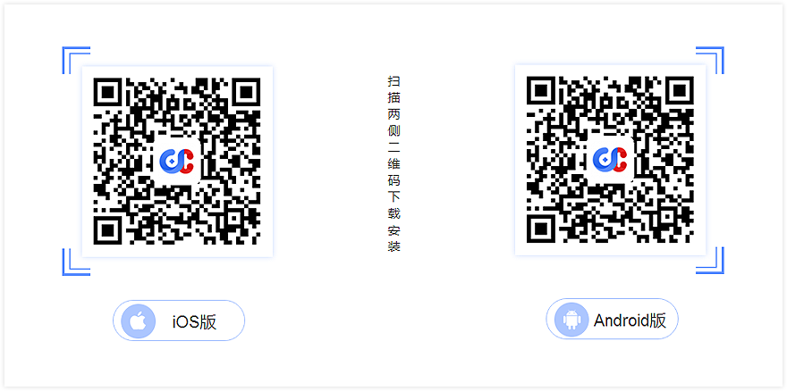
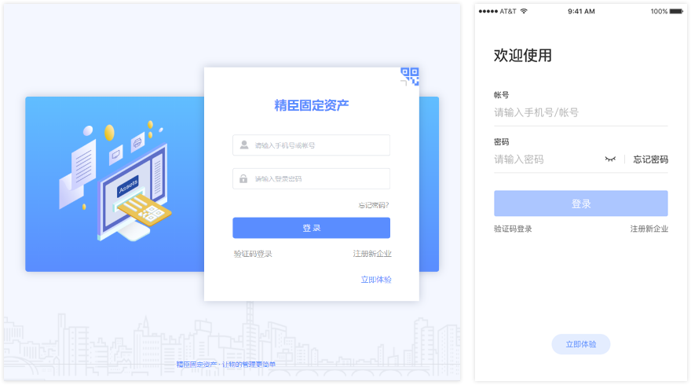
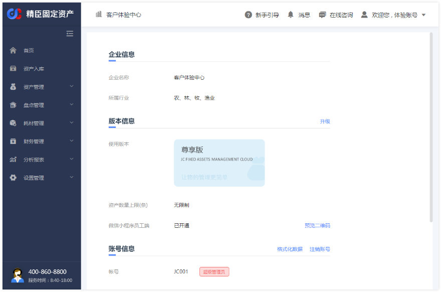

# 概述
精臣固定资产管理云平台是基于SAAS模式的固定资产管理系统，为企业提供资产管理、资产盘点、标签自助打印、耗材管   
理、员工端、标签机及耗材等软硬件综合解决方案   
本系统目前包括多个客户端版本：

### 1. PC端
地址：[https://www.jingchenyun.com/#/login](https://www.jingchenyun.com/#/login)  
支持浏览器包括： 火狐浏览器（Firefox）、谷歌浏览器（Chrome）、360浏览器极速模式，QQ浏览器，搜狗浏览器等，不支持IE浏览器

### 2. 移动端
移动端包括支持安卓（Android5.0及以上）及IOS（IOS9.3及以上）系统版本，手机可在苹果和安卓各大应用市场搜索“精臣固定资产”下载最新安装包；也可用手机自带浏览器扫描精臣固定资产官网二维码下载  
精臣固定资产官网地址：[https://www.jingchenyun.com/#/start](https://www.jingchenyun.com/#/start)

### 体验账号
为方便用户体验系统所有功能，平台在PC端及APP端登录页提供了体验账号入口   

用户点击【立即体验】按钮，无需登录，即可体验尊享版全部功能   
  

注：为保障用户体验效果，体验账号数据将定期清理，请勿在体验账号内保存关键数据

